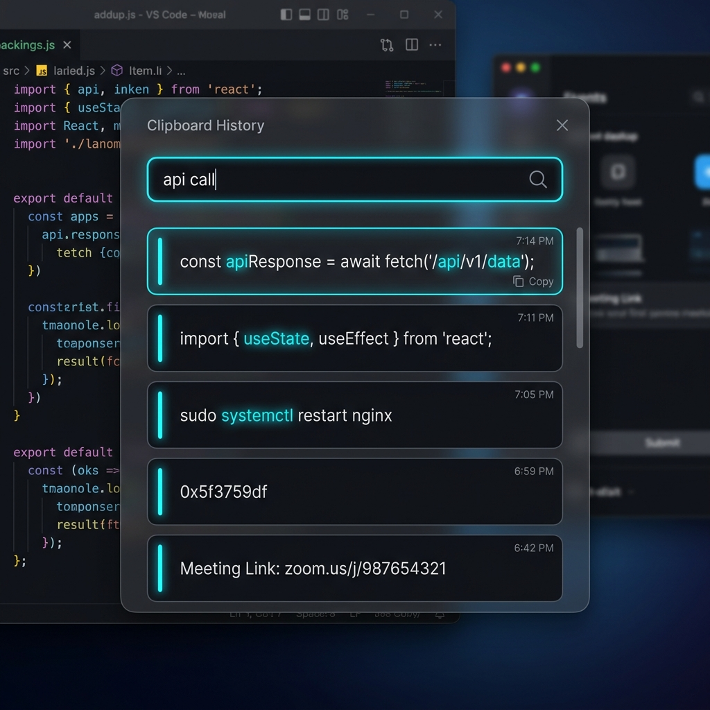
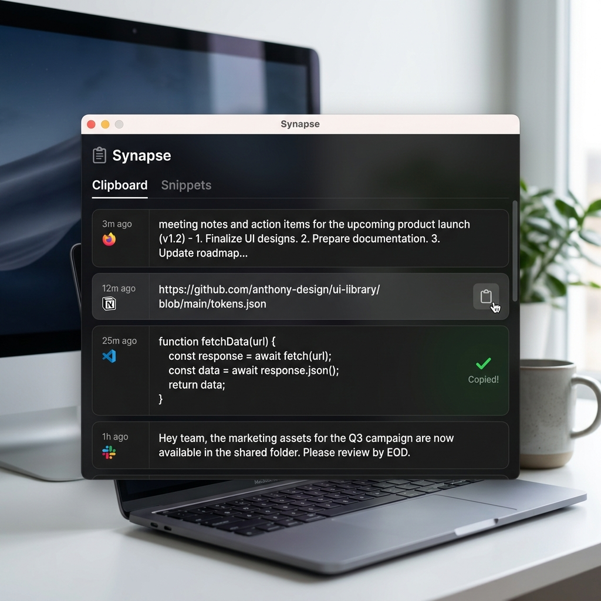

# Clipo
**The Ultra-Fast (1ms) Clipboard Manager for Windows.**

Clipo is an extremely lightweight, high-performance clipboard history manager engineered for speed and efficiency. With a minimalist dark UI, instant search filtering, and native Win32 API integration, it guarantees a seamless workflow with virtually zero system impact.



## 🚀 Features
* **Extreme Performance:** Engineered for a `<1ms` response time even with over 10,000 saved clips.
* **Smart Memory Management:** Aggressive active RAM trimming ensures `<10MB` idle memory footprint.
* **SQLite Persistence:** Uses a high-speed SQLite database with `WAL` journal mode and disabled synchronous writes for immediate I/O.
* **Zero-CPU Monitoring:** Relies on native Win32 APIs (`AddClipboardFormatListener`) for completely silent, zero-CPU background monitoring.
* **Global Hotkey:** Press `SHIFT + SPACE` from anywhere to instantly toggle the popup window.
* **Location Persistence:** Clipo remembers the exact X/Y screen coordinates where you last positioned it.

## 🎨 UI & UX
* **Minimalist Dark Theme:** Sleek, borderless glass-like popup that stays out of your way.
* **Instant Actions:** Double-press `SPACE` to hide the window immediately.
* **Safe Exit ("X" Button):** Clicking the exit button simply hides the app to the System Tray to keep the monitoring active. You can completely close it from the Tray menu.
* **Search Highlighting:** Find what you need instantly with bright Neon Blue highlighting for matching text.
* **Quick Copy:** Click the minimalist `📋` icon to securely copy to the clipboard with a satisfying green `✓` visual confirmation.



## 📥 Installation & Usage
Clipo is completely portable. There is no installer required!

1. Download the latest `Clipo.exe` from the [Releases](https://github.com/your-username/clipo/releases) section.
2. Run `Clipo.exe` (it will silently start in the system tray).
3. Copy any text as usual.
4. Press `SHIFT + SPACE` to bring up the UI and paste!

## ⚙️ Build from Source
If you prefer to compile it yourself, clone the repository and run:
```bash
dotnet publish -c Release -r win-x64 --self-contained true -p:PublishSingleFile=true -p:IncludeNativeLibrariesForSelfExtract=true
```
