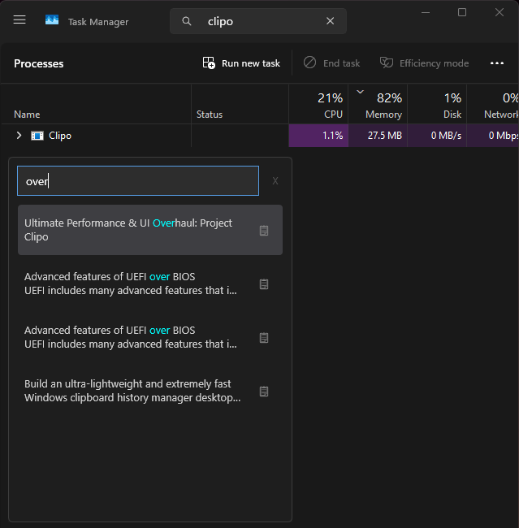

<h1 align="center">Clipo</h1>
<h3 align="center">The Ultra-Fast (1ms) Clipboard Manager for Windows.</h3>

  <em>A high-performance portable clipboard manager built for speed and stability.</em>

## ❓ Why Clipo?
Clipo is designed for power users who need a lightning-fast, zero-distraction clipboard history without the heavy resource overhead of modern Electron apps. It operates silently in the background, consuming practically zero CPU, and delivers an instant pop-up interface exactly when you need it.

---

## 📊 Performance Metrics
Clipo is engineered to be invisible when not in use and incredibly lightweight when active.

  

* **Background Idle:** 5MB - 8MB RAM
* **Active Usage:** 24MB - 30MB RAM
* **Response Time:** 1ms
* **CPU Usage:** ~0% when idle

---

## ✨ Comprehensive Features

* **Stealth Mode:** Lives quietly in your System Tray and only appears when called via the `Shift + Space` hotkey.
* **SQLite Engine:** Reliable data persistence ensures your clips are safely stored and available even across PC reboots.
* **Privacy First (Local-only):** All your clipboard data is stored locally on your machine. No telemetry, no cloud syncing.
* **Smart UI:** 
  * Auto-focuses on the search bar the moment it opens.
  * Instant search highlighting.
  * One-click copy with satisfying visual feedback.

---

## 🎨 User Experience

  

### How to Use
* **`Shift + Space`:** Show/Hide window.
* **Search:** Instant filtering as you type.
* **Copy Icon:** One-click to re-copy full text.
* **`X` Button:** Safely hide back to the System Tray.

---

## 🛠️ Advanced Technical Specifications (For Devs)

* **Architecture:** Built with **.NET 8 WPF**.
* **Performance Logic:** Uses the Native Win32 API (`AddClipboardFormatListener`) for completely event-driven monitoring without polling.
* **Optimization:**
  * **UI Virtualization:** Employs a strict `VirtualizingStackPanel` with fixed heights to render 10,000+ items with zero layout lag.
  * **Active Memory Trimming:** Automatically invokes `SetProcessWorkingSetSize` to aggressively free physical RAM when hidden or idle for 5 seconds.

---

## 🤝 How to Contribute

Clipo is an open-source project and we welcome contributions from the community!
1. ⭐ **Star the repo** if you find it useful.
2. Fork the project.
3. Submit a Pull Request with your enhancements or bug fixes.
