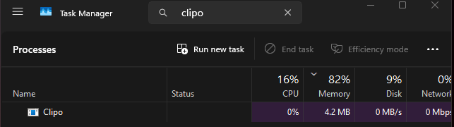

# Clipo
The Ultra-Fast (1ms) Clipboard Manager for Windows.

## Performance
* **Background Idle:** 5MB - 8MB RAM
* **Active Usage:** 24MB - 30MB RAM
* **Response Time:** 1ms

## Features
* **Native Win32 APIs**
* **SQLite**
* **Shift+Space Toggle**
* **Stealth Mode (Hide to Tray)**
